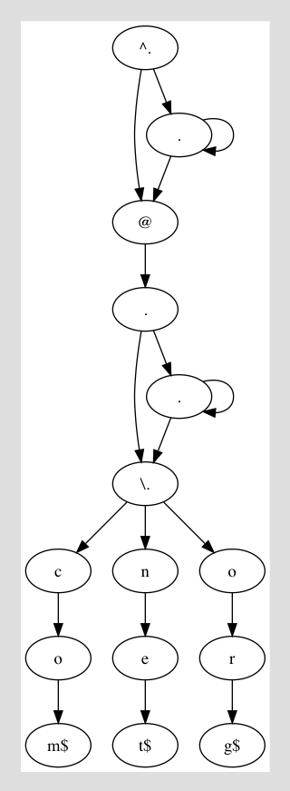

# Regex-Logic

Match strings.

	$ regex-logic match '.+@.+\.(net|com|org)' hello@foo.org meonline.com
	[True,False]

	$ { echo hello@foo.org; echo meonline.com } | regex-logic match '.+@.+\.(net|com|org)'
	hello@foo.org

Parse and validate regexes.

	$ regex-logic valid '.+@.+\.(net|com|org)'
	Right (.)+@(.)+\.((net)|(com))|(org)

	$ regex-logic parse '.+@.+\.(net|com|org)'
	Right (Concat (Concat (Concat (Concat (Plus Any) (Lit '@')) (Plus Any)) (Lit '.')) (Alt (Alt (Concat (Concat (Lit 'n') (Lit 'e')) (Lit 't')) (Concat (Concat (Lit 'c') (Lit 'o')) (Lit 'm'))) (Concat (Concat (Lit 'o') (Lit 'r')) (Lit 'g'))))

	$ regex-logic dfa '.+@.+\.(net|com|org)'

Generate strings that would match the regex.

	$ regex-logic generate '.+@.+\.(net|com|org)' | head
	a@a.net
	a@a.org
	a@a.com
	a@aa.net
	a@aa.org
	a@aa.com
	a@aaa.net
	a@aaa.org
	a@aaa.com
	a@ab.net
